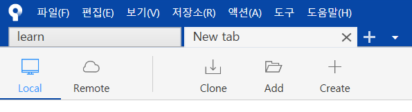
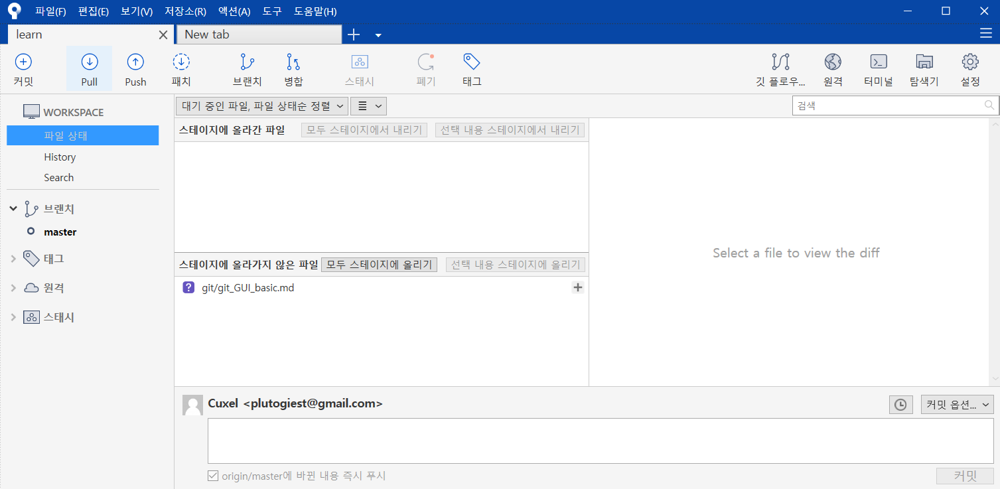
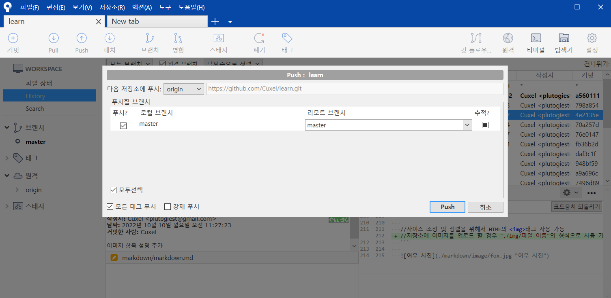
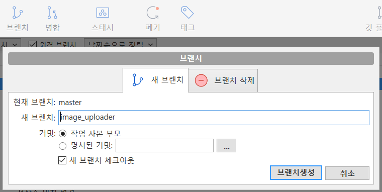
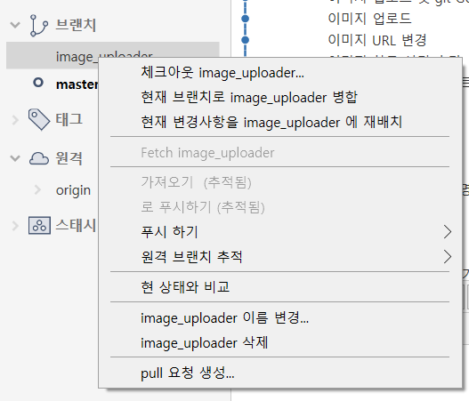
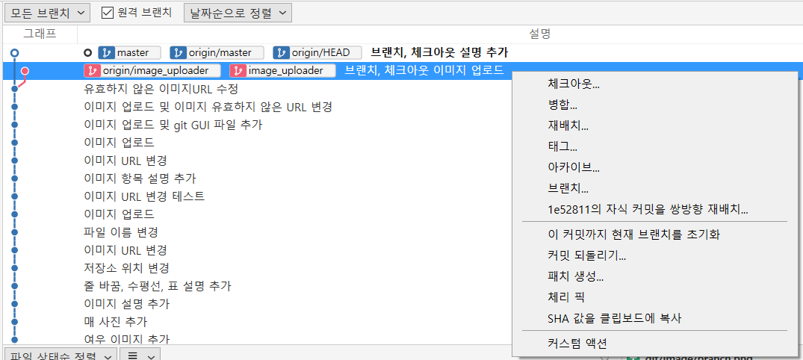
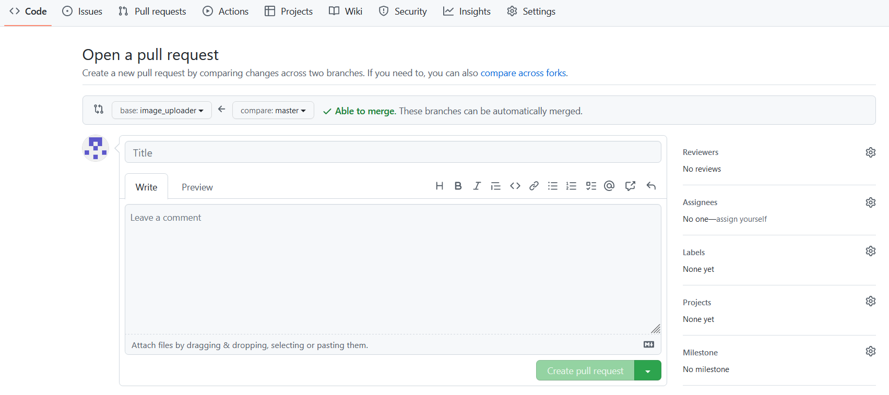
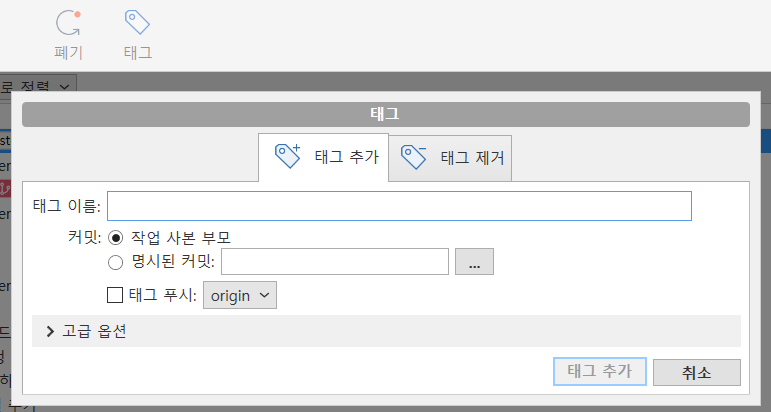

# Sourcetree를 이용한 Git GUI 사용법  
## 소스트리에 리포지토리 불러오기  
  
|항목|기능|
|:---:|:---:|
|Local|저장되어 있는 로컬 Git 저장소를 불러옴|
|Remote|GitHub에 저장된 원격 저장소를 불러옴|
|Clone|원격 저장소를 내컴퓨터에 받아오고 소스트리에도 추가|
|Add|내 컴퓨터에서 이미 만든 로컬 저장소를 소스트리에 추가|
|Create|내 컴퓨터의 폴더에 새로운 로컬저장소를 생성|    
## Commit & Push  
  
1. 변경된 파일을 스테이지에 올림
2. 커밋 코멘트 작성
3. 커밋 버튼 클릭 (바뀐 내용 즉시 푸시 체크시 커밋과 동시에 푸시 가능)  

 
1. Push 버튼 클릭
2. 푸시 할 브랜치를 선택
3. 푸시 버튼 클릭 (강제 푸시는 혼자 사용하는 브랜치에만 할 것)  
## Branch & Checkout  
  
1. Branch 버튼 클릭
2. 현재 브랜치 확인
3. 새 브랜치 이름 작성 (feature/fucntion 방식으로 작성하면 앞의 텍스트 feature를 브랜치를 구분하는 폴더처럼 사용 가능)
4. 브랜치 생성 버튼 클릭 (새 브랜치에 체크아웃 체크시 브랜치 생성과 동시에 만들어진 브랜치로 체크아웃)  

- 체크아웃 하고자 하는 브랜치에 우클릭 후 체크아웃 선택 또는 체크아웃 하고자 하는 브랜치 더블클릭  
## Merge  
1. 병합한 결과물을 반영할 브랜치로 체크아웃

2. 병합하려는 커밋에 우클릭 후 병합 선택
3. 팝업창에서 확인 클릭  
## Pull request  
  
1. GitHub에서 풀 리퀘스트 항목 선택
2. base 브랜치와 compare 브랜치 확인
3. 풀 리퀘스트의 이름과 내용 작성
4. Create pull request 버튼 클릭  
## Tag  
  
1. 상단의 태그 버튼 클릭
2. 태그 이름 작성
3. 태그 추가 버튼 클릭