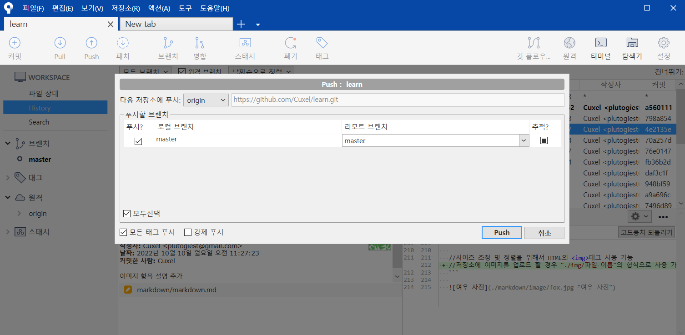

# Sourcetree를 이용한 Git GUI 사용법  
## 소스트리에 리포지토리 불러오기  
  
|항목|기능|
|:---:|:---:|
|Local|저장되어 있는 로컬 Git 저장소를 불러옴|
|Remote|GitHub에 저장된 원격 저장소를 불러옴|
|Clone|원격 저장소를 내컴퓨터에 받아오고 소스트리에도 추가|
|Add|내 컴퓨터에서 이미 만든 로컬 저장소를 소스트리에 추가|
|Create|내 컴퓨터의 폴더에 새로운 로컬저장소를 생성|    
## Commit & Push  
  
1. 변경된 파일을 스테이지에 올림
2. 커밋 코멘트 작성
3. 커밋 버튼 클릭 (바뀐 내용 즉시 푸시 체크시 커밋과 동시에 푸시 가능)  

  
1. Push 버튼 클릭
2. 푸시 할 브랜치를 선택
3. 푸시 버튼 클릭 (강제 푸시는 혼자 사용하는 브랜치에만 할 것)