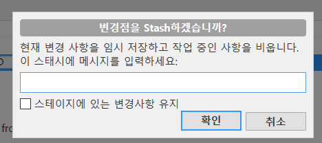

# Sourcetree를 이용한 Git GUI 사용법  
## 소스트리에 리포지토리 불러오기  
  
|항목|기능|
|:---:|:---:|
|Local|저장되어 있는 로컬 Git 저장소를 불러옴|
|Remote|GitHub에 저장된 원격 저장소를 불러옴|
|Clone|원격 저장소를 내컴퓨터에 받아오고 소스트리에도 추가|
|Add|내 컴퓨터에서 이미 만든 로컬 저장소를 소스트리에 추가|
|Create|내 컴퓨터의 폴더에 새로운 로컬저장소를 생성|    
## Commit & Push  
  
1. 변경된 파일을 스테이지에 올림
2. 커밋 코멘트 작성
3. 커밋 버튼 클릭 (바뀐 내용 즉시 푸시 체크시 커밋과 동시에 푸시 가능)  

 
1. Push 버튼 클릭
2. 푸시 할 브랜치를 선택
3. 푸시 버튼 클릭 (강제 푸시는 혼자 사용하는 브랜치에만 할 것)  
## Branch & Checkout  
  
1. Branch 버튼 클릭
2. 현재 브랜치 확인
3. 새 브랜치 이름 작성 (feature/fucntion 방식으로 작성하면 앞의 텍스트 feature를 브랜치를 구분하는 폴더처럼 사용 가능)
4. 브랜치 생성 버튼 클릭 (새 브랜치에 체크아웃 체크시 브랜치 생성과 동시에 만들어진 브랜치로 체크아웃)  

- 체크아웃 하고자 하는 브랜치에 우클릭 후 체크아웃 선택 또는 체크아웃 하고자 하는 브랜치 더블클릭  
## Merge  
1. 병합한 결과물을 반영할 브랜치로 체크아웃

2. 병합하려는 커밋에 우클릭 후 병합 선택
3. 팝업창에서 확인 클릭
4. 충돌이 일어날 경우 충돌을 해결하고 계속 병합  
## Pull request  
  
1. GitHub에서 풀 리퀘스트 항목 선택
2. base 브랜치와 compare 브랜치 확인
3. 풀 리퀘스트의 이름과 내용 작성
4. Create pull request 버튼 클릭  
## Tag  
  
1. 상단의 태그 버튼 클릭
2. 태그 이름 작성
3. 태그 추가 버튼 클릭  
## Fork  
  
1. 포크하려는 GitHub 원격 저장소에서 Fork 선택
2. 리포지토리의 이름과 설명을 작성하고 Create fork 클릭

3. 포크한 원격저장소를 소스트리에 클론한 후 저장소 - 원격 저장소 추가 클릭

4. 추가 버튼 클릭후 이름과 경로 작성 (upstream은 원본 저장소를 지칭하는 관용적 이름)
5. 확인 버튼 클릭

6. 원본 저장소에 우클릭 후 upstream 에서 가져오기 버튼 클릭을 통해 원본저장소의 내용을 패치  
## Rebase  
  
1. 새로운 베이스로 삼고싶은 커밋에 우클릭 한 후 재배치 클릭
2. 팝업 창 확인 버튼 클릭 (리베이스는 반드시 혼자만 사용하는 브랜치에서 할 것)
    - 충돌이 일어난다면 충돌 해결 후 액션 - 재배치 계속 클릭
3. 강제 푸시를 통해 원격 저장소 브랜치의 히스토리 조작  
## Amend
  
1. 커밋 창에서 커밋 옵션 중 마지막 커밋 정정(Amend last commit) 선택
2. 커밋 버튼 클릭
3. 원격 저장소에 강제 푸시 (강제 푸시는 반드시 혼자서 사용하는 브랜치에서만 할 것)  
## Cherry-pick  

- 원하는 커밋에 우클릭 한 후 체리픽 클릭  
## Reset  

1. 초기화 하고싶은 커밋에 우클릭 후 '이 커밋까지 현재 브랜치를 초기화' 클릭
2. 초기화 옵션을 선택하고 확인버튼 클릭  
3. 커밋 후 강제푸시를 통해 원격저장소 이력 조작  
## Revert  
  
- 되돌리고 싶은 커밋에 우클릭 후 커밋 되돌리기 선택  
## Stash  
  
1. 상단의 스태시 탭 클릭
2. 스태시 설명 작성 후 확인 버튼 클릭

3. 불러오고 싶은 스태시에 우클릭 후 스태시 적용 클릭